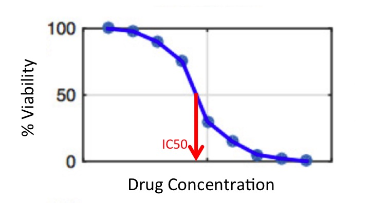
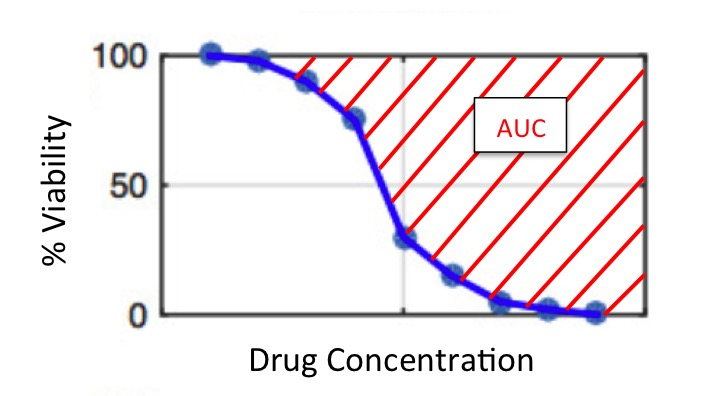

```{r setup, include=FALSE}
knitr::opts_chunk$set(echo = TRUE)
```

## Replicability of large Pharmacological Studies

Hopefully you have had the chance to explore the features of the CCLE and GDSC drug response datasets. If not, it might be a good idea to check out the tutorial on 'Exploratory analysis of pharmacogenomic data' to get a feel for what types of variables the datasets contain, and learn about the difference between the raw dataset, which contains the cell line viability at each drug concentration, and the summarized dataset, which contains numerical summaries of the cell lines response to a drug over all concentrations. 

In this tutorial we'll learn more about summary measures of drug response, and then use scatterplots and correlation measures to assess the agreement of these summary measures in the two studies. 

## Summary measurements of drug response

Recall that in the summarized dataset, for each cell line and drug combination, the cell line viability over all drug concentrations has been summarized into a single number, which represents the *overall effect of the drug on the cell line*. Essentially, There are many different ways this could be done, and our data provides two possible measures: 

1. IC50: the estimated concentration of the drug that will result in half (50%) of the cells surviving. 



Are cell lines with higher IC50 values more or less susceptible? What about drugs with higher IC50 values - are they more or less toxic?


> Place your answer here


2. AUC (Area Under the Curve): despite the name, this is actually the area *above* the curve estimated by the drug concentration and viability data (or 1-area under the curve). Note that the estimation of this curve is not a simple task in itself - check out the vignette on summarizing the relationship between two variables to learn more. 



Are cell lines with higher values of AUC more or less resistant?

> Place your answer here

Are drugs with higher AUC more or less toxic?

> Place your answer here

## Load the summarized pharmacological dataset into the session
First, we'll read in the .csv file that contains the summarized pharmacological data (including the IC50 and AUC values for each drug and cell line combination, as described above). 

```{r read csv}
cellLinesSummary <- read.csv("summarizedPharmacoData.csv", header=TRUE)
str(cellLinesSummary)

length(unique(cellLinesSummary$cellLine))
length(unique(cellLinesSummary$drug))
```

Notice that there are 2,257 rows - each row here corresponds to a cell line-drug combination. 
Making up these combinations are 288 unique cell lines, and 15 drugs. 

Was every cell line in the dataset tested with every drug?

> Place your answer here

## Comparing response of drug AZD0530 in the two studies

So we now have summary measures (IC50 and AUC) that indicate the responses of cell lines to drugs. However, each study measured these values separately. The goal of this analysis is to **investigate how well these two studies agree with each other**. In other words, do the drug response results in one study **replicate** in the other study? 

First, we'll examine this question for one of the drugs in particular: AZD0530. We'll start out by visually exploring how the AUC values for AZD0530 compare in the two datasets using a scatterplot.

```{r AUC 1 drug}
library(ggplot2)
ggplot(aes(x=auc_GDSC, y=auc_CCLE), data=subset(cellLinesSummary, drug=="AZD0530")) +
    geom_point() +
    xlab("GDSC AUC") +
    ylab("CCLE AUC") 
```

Perfect agreement between the GDSC and CCLE AUC values would mean all the points would fall on a straight line. How would you describe the level of agreement between the AUC values of drug AZD0530 in the CCLE and GDSC studies? Does it seem like higher values of AUC in the GDSC correspond to higher values in the CCLE?

> Place your answer here

Next, let's look at the same type of scatterplot for the IC50 values. 

```{r ic50 1 drug}
ggplot(aes(x=ic50_GDSC, y=ic50_CCLE), data=subset(cellLinesSummary, drug=="AZD0530")) +
    geom_point() +
    xlab("GDSC IC50") +
    ylab("CCLE IC50") 
```

What is different about this plot compared to the AUC plot for this drug above? 

> Place your answer here

First, you may notice that there are many points with the highest value of IC50 for CCLE. Recall that this study measured a fixed set of doses, regardless of how the cells responded, whereas in the GDSC drug concentrations were increased if no response was observed. What does this mean for the IC50 values in the CCLE? Are they more likely to be too high or too low? Why?

> Place your answer here

Another thing to notice is that there is a very large range of IC50 values in the GDSC, but most values are small. This indicates a *skewed* distribution that may benefit from a log-transformation. Next, we'll plot log10-transformed values of IC50. We'll also plot *negative* values, so that increasing values of IC50 represent increasing drug toxicity (to make the plot more comparable to the AUC plot above).

```{r ic50 1 drug log}
ggplot(aes(x=-log10(ic50_GDSC), y=-log(ic50_CCLE)), data=subset(cellLinesSummary, drug=="AZD0530")) +
    geom_point() +
    xlab("-log10(GDSC IC50)") +
    ylab("-log10(CCLE IC50)") 
```


How would you describe the level of agreement between the IC50 values of drug AZD0530 in the CCLE and GDSC studies? Does it seem like higher values of AUC in the GDSC correspond to higher values in the CCLE?

> Place your answer here

## Comparing summary measures of drug response across all drugs

So far, we have only looked at how well the two studies agree for the response measurements of a single drug. However, we need to look at the rest of the drugs to fully assess the level of replication. First, we set out to reproduce Figure 2 in the Haibe-Kains paper, which displays 
scatter plots of IC50 values for the 15 drugs that were probed in both the CCLE and GDSC. Essentially, we are going to make the plots from the previous section for all 15 drugs at once and compare them side-by-side.

```{r Fig2 raw}
ggplot(aes(x=-log10(ic50_GDSC), y=-log10(ic50_CCLE)), data=cellLinesSummary) +
    geom_point(cex=0.5) + 
    facet_wrap(facets=~drug) +
    xlab("-log10(GDSC IC50)") +
    ylab("-log10(CCLE IC50)") 
```

Why do the ranges of the axes not exactly match the axes in Figure 2 of the published paper? Note that the concentrations reported in the `cellLinesSummary` dataset are given in units of mili-molar, however the plots contain values calculated on the nano-molar
scale (1 million times smaller). Thus, we can reproduce the original plot's scale by scaling the concentration values by 10^6.

```{r Fig2 nano}
ggplot(aes(x=-log10(ic50_GDSC/10^6), y=-log10(ic50_CCLE/10^6)), data=cellLinesSummary) +
    geom_point(cex=0.5) + 
    facet_wrap(facets=~drug) +
    xlab("-log10(GDSC IC50/10^6)") +
    ylab("-log10(CCLE IC50/10^6)") 
```

Compare this plot to Figure 2 in the Haibe-Kains reanalysis paper. Does it seem to agree?

> Place your answer here

Looking at the IC50 values for both studies across all 15 drugs, would you say that they tend to agree? Why or why not?

> Place your answer here

We have visually inspected the agreement of the drug response data between the two studies. Now, we'd like to go a step further and quantify the agreement with statistics. We'll start by exploring measures of correlation.

## Compare correlations of the drug sensitivity measures

One way to quantify the degree of agreement of two variables is to calculate the *correlation*. Correlation is a statistic between -1 and 1 that measures the degree of association between two variables. In this case our two variables are the drug response in CCLE and the drug response for GDSC. The higher the correlation value, the more the two variables agree with one other. If two variables are exactly the same, then the correlation is equal to 1. If two variables are unrelated, then the correlation value will be close to zero. What would a negative correlation mean?

> Place your answer here

When interpreting a correlation value, we consider how close the value is to 1 (or negative 1). There are no exact rules on calling a correlation "weak" or "strong", but generally values above around 0.7 in magnitude are considered strong and below around 0.3 in magnitude are considered weak. Here are some example scatterplots and their resulting correlation coefficients (using the Pearson method to calculate - more on this below). 

```{r, correlation ex}
# set seed for reproducibility
set.seed(738)

# Perfect correlation
x <- rnorm(50)
perfect <- data.frame(x=x, y=x)
cor.coef <- round(cor(perfect$x, perfect$y),2)
ggplot(data=perfect, aes(x=x,y=y)) +
  geom_point() +
  ggtitle(paste0("Correlation coefficient = ", cor.coef)) + 
  geom_smooth(method='lm', se=FALSE)

# Strong correlation
x <- rnorm(50,0,2)
strong <- data.frame(x=x, y=x+rnorm(50,0,0.75))
cor.coef <- round(cor(strong$x, strong$y),2)
ggplot(data=strong, aes(x=x,y=y)) +
  geom_point() +
  ggtitle(paste0("Correlation coefficient = ", cor.coef))+ 
  geom_smooth(method='lm', se=FALSE)

# Moderate correlation
x <- rnorm(50,0,2)
moderate <- data.frame(x=x, y=x+rnorm(50,0,2.5))
cor.coef <- round(cor(moderate$x, moderate$y),2)
ggplot(data=moderate, aes(x=x,y=y)) +
  geom_point() +
  ggtitle(paste0("Correlation coefficient = ", cor.coef))+ 
  geom_smooth(method='lm', se=FALSE)

# Weak correlation
x <- rnorm(50,0,1)
weak <- data.frame(x=x, y=x+rnorm(50,0,4))
cor.coef <- round(cor(weak$x, weak$y),2)
ggplot(data=weak, aes(x=x,y=y)) +
  geom_point() +
  ggtitle(paste0("Correlation coefficient = ", cor.coef))+ 
  geom_smooth(method='lm', se=FALSE)

# No correlation
x <- rnorm(50,0,2)
none <- data.frame(x=x, y=rnorm(50),0,2)
cor.coef <- round(cor(none$x, none$y),2)
ggplot(data=none, aes(x=x,y=y)) +
  geom_point() +
  ggtitle(paste0("Correlation coefficient = ", cor.coef))+ 
  geom_smooth(method='lm', se=FALSE)

```

Note that there are several different types of correlations. For example, we might say that two variables are in agreement if they fall along a straight line when plotted against eachother. Or, we might say they two are in agreement if an increase in one tends to be associated with an increase in the other (but not necessarily along a straight line). We'll start by examining two different types:

1. **Pearson's** correlation coefficient: measures the degree of *linear* association 

2. **Spearman's** correlation coefficient: measures the agreement of the *rankings* of the values of one variable compared to the other.

To understand the difference, here is an example where the two correlation measures are similar, and an example where they differ substantially.

```{r, spearman vs pearson}
# Same
x <- rnorm(50,0,1)
corrcomp <- data.frame(x=x, y=x+rnorm(50,0,1))
cor.pearson <- round(cor(corrcomp$x, corrcomp$y, method="pearson"),2)
cor.spearman <- round(cor(corrcomp$x, corrcomp$y, method="spearman"),2)
ggplot(data=corrcomp, aes(x=x,y=y)) +
  geom_point() +
  ggtitle(paste0("Pearson = ", cor.pearson, ", Spearman = ", cor.spearman))+ 
  geom_smooth(method='lm', se=FALSE)

# Different
x <- rnorm(50,0,2)
corrcomp <- data.frame(x=x, y=exp(x))
cor.pearson <- round(cor(corrcomp$x, corrcomp$y, method="pearson"),2)
cor.spearman <- round(cor(corrcomp$x, corrcomp$y, method="spearman"),2)
ggplot(data=corrcomp, aes(x=x,y=y)) +
  geom_point() +
  ggtitle(paste0("Pearson = ", cor.pearson, ", Spearman = ", cor.spearman))

```

In the previous example, why is the Spearman correlation so high, while the Pearson correlation is only moderate?

> Place your answer here

Now we'll summarize different measures of correlation of the IC50 values to assess the level of 
replication between these two experiments. First, we'll compute the two different measures for correlating 
continous variables mentioned above (Pearson and Spearman correlation coefficients).

```{r ic50 correlation}
library(dplyr)

drugCorrs <- cellLinesSummary %>% 
    group_by(drug) %>% summarise(Pearson_ic50=cor(-log10(ic50_GDSC/10^6),-log10(ic50_CCLE/10^6), method="pearson"),
                                 Spearman_ic50=cor(-log10(ic50_GDSC/10^6),-log10(ic50_CCLE/10^6), method="spearman"))

drugCorrs
```

Next, we'll visualize the correlations the IC50 measurements in a grouped bar plot.

```{r barplot correlations ic50}
library(reshape2)
drugCorrs <- melt(drugCorrs)
colnames(drugCorrs) <- c("Drug", "Measure", "Correlation")

drugCorrs_IC50 <- drugCorrs[grep("ic50", drugCorrs$Measure),]
ggplot(data=drugCorrs_IC50, aes(x=Drug, y=Correlation, fill=Measure, group=Measure)) +
  geom_bar(stat="identity", position=position_dodge(), colour="black") + 
  theme(axis.text.x = element_text(angle = 45, hjust = 1)) +
  scale_fill_grey()
```
