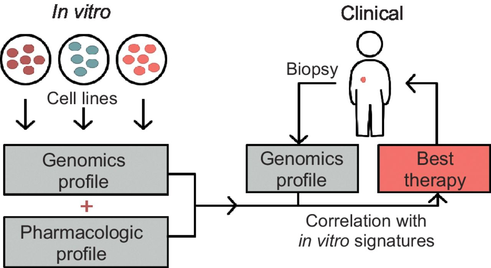

```{r setup, include=FALSE}
knitr::opts_chunk$set(echo = TRUE)
```

## Introduction to Pharmacogenomics and Personalized Cancer Treatment

Large-scale pharmacogenomic studies like the CCLE and GDSC we are investigating have investigated the effects of many anti-cancer drugs on various cell lines. However, the primary interest and motiviation behind these studies is not simply to determine which cell lines are most susceptible to these drugs, but rather **what are the characteristics of the cell lines that are susceptible** to certain drugs? The hope is that this information will be useful in creating improved cancer treatment regimens that will match these characteristics on patients' tumor cells. 

If the hope is to create improved treatment regimens in cancer patients, why would we study cell lines? We have to start in cell lines (looking at the *in vitro* response) when screening many drugs at multiple concentrations, since we need to be able to **compare the effects of drugs and doses on cells of the same type**. Cell lines can be grown continously (even in different labs) to generate comparable samples, whereas clinical patient samples are fixed amounts of cells that would be used up after the experiment.

So what are the *characteristics* to examine when attempting to relate the best treatment regimen with a cell line or patient? These consist of genomic factors (e.g. gene expression, copy number, mutation) as well as pharmacologic (e.g. AUC or IC50 of response to various drugs). It is also of interest to investigate whether similar drugs (*similar* could mean similar mechanism of action) have similar effects. 



Figure from "Tumor-Derived Cell Lines as Molecular Models of Cancer Pharmacogenomics" by
Andrew Goodspeed, et al. Mol Cancer Res, 2016.

The CCLE and GDSC studies both investigated genomic profiles for all the cell lines that were used to study drug response. The genomic profiles collected included gene expression measurements for more than 10,000 genes in every cell line (measured by microarray) and mutation status for a subset of 64 genes in every cell line (measured by targeted sequencing). We will not have time to explore this data, but it is available through the R package `PharmacoGx` if you wish to explore it for a future project. 

The main finding of Haibe-Kains et al. (2013) was that the genomic profiles of the cell lines used in both studies were highly correlated. What you have probably found so far in your explorations of comparing the summary measures of drug response is that the agreement between the studies does not seem highly reproducible. Part of this may be explained by differences in protocol (which you will have noticed in the different drug concentrations tested in the two studies). In the rest of this vignette, we'll investigate further sources of variation and biological mechanisms that might explain some of this lack of agreement.

## Load the summarized pharmacological dataset into the session
First, we'll read in the .csv file that contains the summarized pharmacological data (including the IC50 and AUC values for each drug and cell line combination, as described above). 

```{r read csv}
cellLinesSummary <- read.csv("summarizedPharmacoData.csv", header=TRUE)
str(cellLinesSummary)
```

## Resistant versus Sensitive Cell lines

TO DO: Lead through reproducing Figure 7 in F1000 paper. Implement 'cutoffs' to determine which cell lines are 'sensitive' or 'resistant' to each
drug in each experiment using AUC. Use Matthews correlation to assess agreement of 0/1 classificaitons - simplest to compute by hand?

Examining the Matthew's correlation values that take into account cell line categories, which drug do you think shows the most consistency between the studies? How about the least? 

> Place your answer here

Does this agree with your visual assessment and answers to these same questions in the previous vignette using continuous correlation measures (Pearson and Spearman)?

> Place your answer here

## Targeted versus Broad Effect Drugs

TO DO: Lead through interpretation of above figure in the context of different drug classes: targeted (drugs that are specific to a certain type of cell, possibly due to a specific mutation or expression signature) vs broadly cytotoxic vs no effect.  These categories are listed on page 9 of the f1000 paper. The consideration of this factor is important because "measured response in insensitive cell lines may represent random technical noise that one should not expect to be correlated between experiments"

For one of the targeted drugs, examine the cell lines that were sensitive in both the CCLE and GDSC. See if you can find out what types of cells these are by searching the online Cancer Cell Line Encyclopedia http://www.broadinstitute.org/ccle. This will prompt you to register with a username, password, and email address. If you prefer, you can also search the cell line on various other websites. Based on what you find, are there specific cancer types that this drug might be effective against?

> Place your answer here

## Further Exploration

Here are some suggestions and questions for you to explore with your team:

1. Are there any cell lines that seem to be either (1) consistently sensitive or (2) consistently resistant? What effect might this have on your conclusions and interpretations of the agreement between the studies?

2. The above investigation using Matthew's correlation on the sensitive versus resistant classifications of the cell lines was based on AUC values. How does the analysis change when using IC50 values instead? Note that you'll have to use a different cutoff than the 0.2 used for the AUC since IC50 values are on a much different scale. Justify your choice of cutoff.

3. Pick another one of the targeted drugs. See if you can find out what types of cancers this drug is targeted for using the NCI cancer drug database at https://www.cancer.gov/about-cancer/treatment/drugs. Does the list of cell lines found to be sensitive in both studies agree with this (it may be helpful to look them up at http://www.broadinstitute.org/ccle)?

